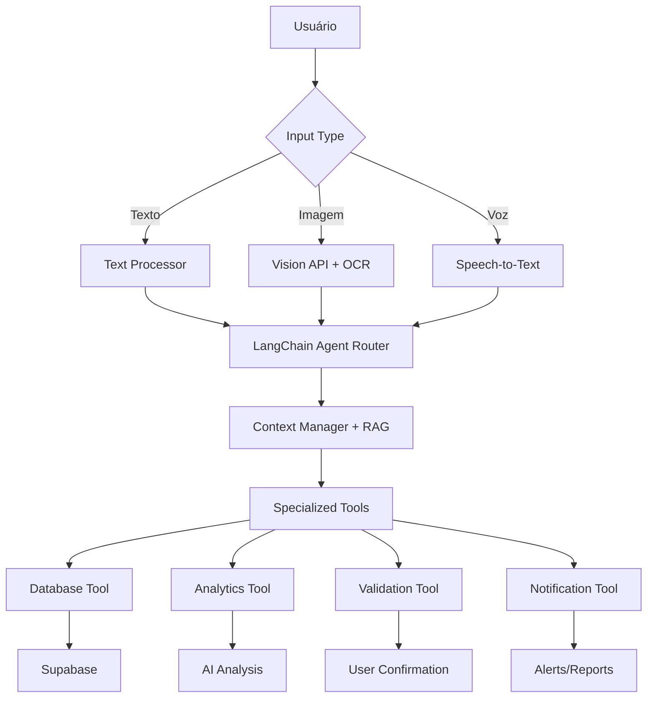

# 🤖 AI Financial Assistant - Roadmap & Architecture

**Status**: 📋 Planejamento | **Última Atualização**: 16/09/2025
**Objetivo**: Criar uma IA financeira completa capaz de processar imagens, texto, executar ações e aprender com o usuário.

---

## 📊 ESTADO ATUAL DO SISTEMA

### ✅ Já Implementado
- **AIChatService**: Sistema modular com análise de sentimento
- **Context Manager**: Acesso aos dados financeiros do usuário
- **Command Interpreter**: Processamento de comandos naturais ("gastei X em Y")
- **Rate Limiting**: Controle de custos da API OpenAI
- **Insight Generator**: Geração de insights financeiros
- **Supabase Integration**: Banco de dados com 15+ tabelas financeiras

### ⚠️ Limitações Atuais
- Sem processamento de imagens/OCR
- Sem memória de longo prazo (vector store)
- Sem function calling estruturado
- Sem sistema multi-agente
- Sem aprendizado contínuo

---

## 🎯 VISÃO GERAL DA ARQUITETURA



---

## 🛠️ CAPACIDADES NECESSÁRIAS

### 1. 👁️ **Visão Computacional & OCR**
**Objetivo**: Processar extratos bancários, cupons fiscais, comprovantes

**Implementação**:
- **OpenAI Vision API** para extração inicial
- **Structured Outputs** com JSON Schema
- **Validação em múltiplas camadas**

**Casos de Uso**:
- [ ] Extrato bancário (PDF/imagem) → transações automáticas
- [ ] Cupom fiscal → categorização inteligente
- [ ] Fatura cartão → reconciliação automática
- [ ] Comprovante PIX → confirmação de transferência

### 2. 🧠 **Sistema de Memória (RAG)**
**Objetivo**: Lembrar padrões, preferências e contexto histórico

**Implementação**:
- **Supabase Vector Store** (pgvector)
- **Text Embeddings** para busca semântica
- **Conversation History** com metadata

**Casos de Uso**:
- [ ] "Como gastei no mês passado?" → busca histórico similar
- [ ] Lembrar preferências de categorização
- [ ] Detectar padrões de gastos anômalos
- [ ] Personalizar sugestões baseadas no perfil

### 3. ⚙️ **Function Calling & Tools**
**Objetivo**: Executar ações no sistema de forma estruturada

**Tools Necessárias**:
```typescript
interface AITools {
  // Database Operations
  queryTransactions: (filters: any) => Promise<Transaction[]>
  createTransaction: (data: TransactionData) => Promise<Transaction>
  updateBudget: (budget: BudgetData) => Promise<Budget>

  // Analytics & Insights
  analyzeSpending: (period: string) => Promise<SpendingAnalysis>
  predictCashFlow: (months: number) => Promise<CashFlowPrediction>
  generateReport: (type: string) => Promise<FinancialReport>

  // External Actions
  sendNotification: (message: string) => Promise<void>
  scheduleReminder: (task: string, date: Date) => Promise<void>
}
```

### 4. 🤖 **Multi-Agent System**
**Objetivo**: Especialização por domínio e processamento paralelo

**Agentes Especializados**:
- **Extraction Agent**: OCR + estruturação de dados
- **Analysis Agent**: Insights e análises complexas
- **Execution Agent**: Operações no banco de dados
- **Validation Agent**: Confirmações e verificações
- **Communication Agent**: Interação natural com usuário

---

## 🏗️ ARQUITETURA TÉCNICA DETALHADA

### **Camada 1: Input Processing**
```typescript
// Multimodal Input Handler
class AIInputProcessor {
  async processText(text: string): Promise<ProcessedInput> {
    return {
      type: 'text',
      content: text,
      intent: await this.classifyIntent(text),
      entities: await this.extractEntities(text)
    }
  }

  async processImage(image: File): Promise<ExtractedData> {
    // OpenAI Vision API
    const response = await openai.vision.create({
      model: "gpt-4o",
      messages: [{
        role: "user",
        content: [
          { type: "text", text: "Extract financial data from this document" },
          { type: "image_url", image_url: { url: imageUrl } }
        ]
      }],
      response_format: { type: "json_schema", json_schema: ExtractedDataSchema }
    })

    return response.parsed
  }
}
```

### **Camada 2: LangChain Agent Orchestration**
```typescript
// Main Financial Agent
const financialAgent = createReactAgent({
  llm: new ChatOpenAI({ model: "gpt-4o" }),
  tools: [
    new DatabaseQueryTool(),
    new TransactionCreateTool(),
    new OCRExtractionTool(),
    new AnalyticsTool(),
    new ValidationTool(),
    new NotificationTool()
  ],
  checkpointer: new SupabaseMemorySaver(),
  prompt: buildFinancialPrompt()
})
```

### **Camada 3: Vector Memory & RAG**
```typescript
// Supabase Vector Integration
class FinancialMemoryManager {
  async storeInteraction(interaction: UserInteraction) {
    const embedding = await openai.embeddings.create({
      input: interaction.summary,
      model: "text-embedding-3-small"
    })

    await supabase
      .from('ai_memory')
      .insert({
        user_id: interaction.userId,
        content: interaction.content,
        embedding: embedding.data[0].embedding,
        metadata: interaction.metadata,
        timestamp: new Date().toISOString()
      })
  }

  async searchRelevantContext(query: string, limit = 5) {
    const queryEmbedding = await this.getEmbedding(query)

    return await supabase.rpc('search_financial_memory', {
      query_embedding: queryEmbedding,
      match_count: limit,
      match_threshold: 0.7
    })
  }
}
```

### **Camada 4: Specialized Tools**
```typescript
// Database Tool with Validation
class DatabaseTool extends Tool {
  name = "database_query"
  description = "Query and modify financial data"

  async _call(input: string) {
    const operation = JSON.parse(input)

    // Validate operation
    const validation = await this.validateOperation(operation)
    if (!validation.safe) {
      return `Cannot execute: ${validation.reason}`
    }

    // Execute with transaction
    return await supabase.transaction(async (trx) => {
      const result = await this.executeOperation(operation, trx)
      await this.logOperation(operation, result)
      return result
    })
  }
}
```

---

## 📅 ROADMAP DE IMPLEMENTAÇÃO

### 🏃‍♂️ **SPRINT 1: Foundation (2 semanas)**
**Objetivo**: Preparar infraestrutura base

#### Week 1: Database & Memory
- [ ] **Supabase Vector Setup**
  - Criar tabela `ai_memory` com embeddings
  - Instalar extensão `pgvector`
  - Criar funções de busca semântica

- [ ] **Memory Manager**
  - Implementar `FinancialMemoryManager`
  - Funções de store/retrieve embeddings
  - Integration com OpenAI embeddings

#### Week 2: Function Calling
- [ ] **OpenAI Function Calling**
  - Definir schemas das tools
  - Implementar tool execution
  - Error handling e validation

- [ ] **Basic Tools**
  - DatabaseQueryTool
  - TransactionCreateTool
  - AnalyticsTool

### 🚀 **SPRINT 2: Vision & OCR (2 semanas)**
**Objetivo**: Processar imagens de extratos e comprovantes

#### Week 3: Vision API Integration
- [ ] **OpenAI Vision Setup**
  - Configurar Vision API
  - Criar schemas para extração
  - Testes com extratos reais

- [ ] **Image Processing Pipeline**
  - Upload e preprocessamento
  - Extração estruturada
  - Validation com usuário

#### Week 4: OCR Refinement
- [ ] **Structured Extraction**
  - JSON Schema para diferentes tipos
  - Post-processing e limpeza
  - Confidence scoring

- [ ] **User Confirmation Flow**
  - Interface de review
  - Correção manual
  - Feedback loop

### 🧠 **SPRINT 3: LangChain Agents (2 semanas)**
**Objetivo**: Sistema multi-agente inteligente

#### Week 5: Agent Framework
- [ ] **LangChain Integration**
  - Setup do framework
  - Agent orchestration
  - Tool binding

- [ ] **Specialized Agents**
  - ExtractionAgent
  - AnalysisAgent
  - ExecutionAgent

#### Week 6: Advanced Workflows
- [ ] **Complex Flows**
  - Multi-step operations
  - Inter-agent communication
  - Error recovery

- [ ] **Learning System**
  - Pattern recognition
  - Preference learning
  - Continuous improvement

### 🎯 **SPRINT 4: Integration & Polish (1 semana)**
**Objetivo**: Finalizar integração e testes

#### Week 7: Final Integration
- [ ] **End-to-End Testing**
  - Complete workflows
  - Performance optimization
  - Security validation

- [ ] **Production Readiness**
  - Error monitoring
  - Rate limiting
  - Fallback mechanisms

---

## 🔐 SEGURANÇA & COMPLIANCE

### **Validação em Múltiplas Camadas**
1. **Schema Validation**: JSON Schema para todos os inputs
2. **Business Rules**: Validação de regras financeiras
3. **User Confirmation**: Aprovação para operações críticas
4. **Audit Trail**: Log completo de todas as operações

### **Privacy & Data Protection**
- ❌ **Nunca** enviar dados PII brutos para OpenAI
- ✅ **Sempre** usar IDs e metadados anonimizados
- ✅ **Criptografar** embeddings sensíveis
- ✅ **Auditoria** completa de acesso aos dados

### **Cost Control**
- **Rate Limiting**: Limites por usuário/período
- **Token Optimization**: Cache de respostas comuns
- **Model Selection**: GPT-4o para tasks complexas, mini para simples
- **Batch Operations**: Agrupar operações relacionadas

---

## 🧪 TESTING STRATEGY

### **Unit Tests**
- [ ] Tool execution
- [ ] Memory operations
- [ ] Schema validation
- [ ] Business logic

### **Integration Tests**
- [ ] OpenAI API integration
- [ ] Supabase operations
- [ ] End-to-end workflows
- [ ] Error scenarios

### **User Acceptance Tests**
- [ ] Extract upload → transaction creation
- [ ] Natural language commands
- [ ] Complex analytical queries
- [ ] Mobile experience

---

## 📚 STACK TECNOLÓGICA

```typescript
const aiStack = {
  // Core AI
  llm: "OpenAI GPT-4o + GPT-4o-mini",
  vision: "OpenAI Vision API",
  embeddings: "text-embedding-3-small",

  // Framework
  agent: "LangChain.js",
  memory: "Supabase Vector (pgvector)",

  // Backend
  database: "Supabase PostgreSQL",
  realtime: "Supabase Realtime",
  storage: "Supabase Storage",

  // Validation & Types
  schema: "Zod + JSON Schema",
  types: "TypeScript",

  // Monitoring
  observability: "LangSmith / Langfuse",
  analytics: "Supabase Analytics",

  // Testing
  unit: "Jest + Testing Library",
  e2e: "Playwright",
  load: "Artillery"
}
```

---

## 🎉 SUCCESS METRICS

### **Funcionalidade**
- [ ] **95%** accuracy na extração de extratos
- [ ] **<3s** response time para queries simples
- [ ] **<10s** processing time para imagens
- [ ] **99%** uptime do serviço

### **Experiência do Usuário**
- [ ] **90%** satisfaction score
- [ ] **<5** interactions para completar task complexa
- [ ] **80%** users ativos mensalmente
- [ ] **<1%** error rate em operações críticas

### **Business**
- [ ] **50%** reduction em time-to-insight
- [ ] **30%** increase em financial awareness
- [ ] **40%** improvement em budget adherence
- [ ] **<$50/mo** AI costs per active user

---

## 📋 PRÓXIMAS AÇÕES

### **Decisões Imediatas**
1. **Confirmar prioridades** com stakeholders
2. **Setup ambiente** de desenvolvimento
3. **Criar primeira POC** com Vision API
4. **Definir métricas** de sucesso detalhadas

### **Esta Semana**
- [ ] Configurar Supabase Vector extension
- [ ] Testar OpenAI Vision com extrato real
- [ ] Criar primeira tool de query
- [ ] Setup do repositório de desenvolvimento

---

**📝 Notas de Desenvolvimento**
- Este documento será atualizado conforme progresso
- Cada feature terá branch específica no Git
- Code reviews obrigatórios para mudanças em AI
- Deploy staging antes de production sempre

---
*Última atualização: 16/09/2025 - Victor*